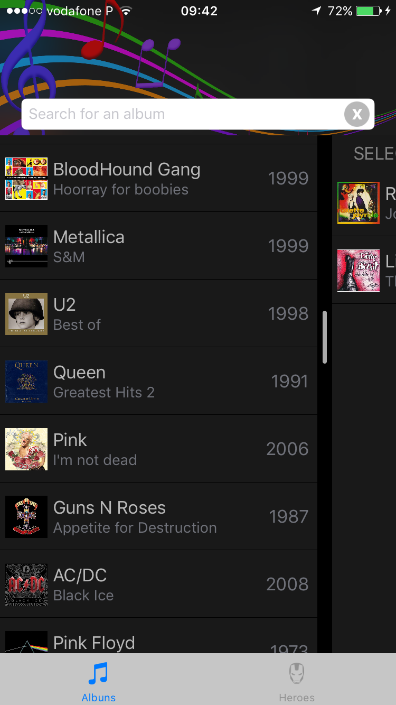
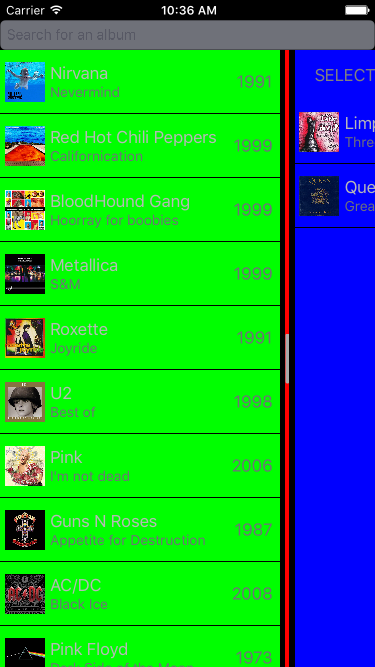

# iOS-MultiSelectionTable
Beautifull way of having a multi-selection table on iOS

<p align="center">
  
  
  
  
</p>

Based on this dribble:
https://dribbble.com/shots/2904577-Multi-Selection-Experiment

#How it works:
```MultiSelectionTable``` underneath is composed of a view and a data source, much like the ```UITableView```'s ```UITableViewDataSource/Delegate```. They both know each other and communicate between themselves.
The view is is composed by two configurable ```UITableView``` and a line seperating them. The DataSource keeps the data the ```UITableView```s display. 

#####Considerations: 
- In order to achieve a nice animation, cells on the right (selected cells) must be equal to the cells on the left (all items cells).
- The item object you are displaying, must conform with the ```Equatable``` protocol so the control can know where to move the items when unselecting items.
-You can also paginate and use search on your items list. The table keeps a reference to the selected items. 

#Usage:

Most basic usage:

Considering you are using MultiSelectionTableView in ViewController:

```swift

var multiSelectionDataSource: MultiSelectionDataSource<MyItem>! //MyItems must be Equatable
var multiSelectionTableView: MultiSelectionTableView!

var allItems: [MyItem] = [] //MyItem must be Equatable

override func viewDidLoad() {
     super.viewDidLoad()
        
     multiSelectionTableView = MultiSelectionTableView()
     view.addSubview(multiSelectionTableView)
     
     multiSelectionDataSource = MultiSelectionDataSource(multiSelectionTableView: multiSelectionTableView)
     multiSelectionDataSource.delegate = self
     let cellReuseIdentifier = "MyCell"
     multiSelectionDataSource.register(nib: UINib(nibName: "MyCustomCellNibName", bundle: nil), for: cellReuseIdentifier)
        
     multiSelectionDataSource.allItems = allItems
      
     multiSelectionTableView.dataSource = multiSelectionDataSource
 }

extension ViewController : MultiSelectionTableDelegate {
    
    func paint(_ cell: UITableViewCell, for indexPath: IndexPath, with item: Any) {
        if let cell = cell as? MyCustomCell,
            let myItem = item as? MyItem {
            //configureCellWithMyItem
        }
    }
    
}
    
```
### Configuration
- Colors style
```swift
multiSelectionTableView.controlBackgroundColor = .black
multiSelectionTableView.allItemsTableBackgroundColor = .black
multiSelectionTableView.selectedItemsTableBackgroundColor = .black
```
- Horizontal movement width: 
  - Depending on your cell, you might want to set the horizontal width the line moves. This value is based on the center X anchor. 
```swift
multiSelectionTableView.seperatorWidthOffset = 100 //will move 100 point on both directions from the center
```

### TODO
- Expose actions of selected and unselected items
- Allow seperatorWidthOffset for both left and right animations

## Author

Nuno Gonçalves

||
|:------------- | -------------:|
| nunogoncalves | @goncalvescmnuno |

##Licence

**iOS-MultiSelectionTable** is available under the MIT license. See the [LICENSE](https://github.com/nunogoncalves/iOS-MultiSelectionTable/blob/master/LICENSE.md) file for more info.
