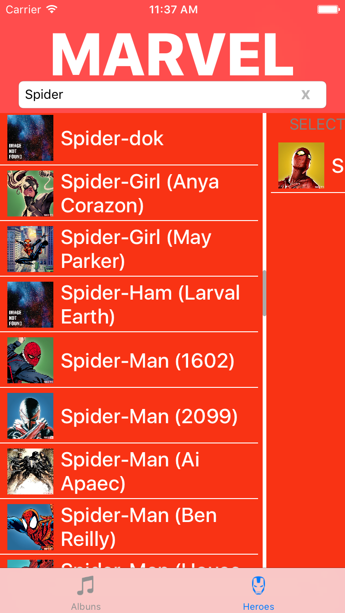

# iOS-MultiSelectionTable
Beautifull way of having a multi-selection table on iOS

[](https://developer.apple.com/swift/)
[](https://developer.apple.com/swift/)
[](https://developer.apple.com/swift/)
[](https://opensource.org/licenses/MIT)
[]()

<p align="center">
  
  
  
  
</p>

Based on [this](https://dribbble.com/shots/2904577-Multi-Selection-Experiment) dribbble by [Vitaly Rubtsov](https://dribbble.com/Vitwai)

## How it works:
```MultiSelectionTable``` underneath is composed of a view and a data source, much like the ```UITableView```'s ```UITableViewDataSource/Delegate```. They both know each other and communicate between themselves.
The view is is composed by two configurable ```UITableView``` and a line seperating them. The DataSource keeps the data the ```UITableView```s display.

## Considerations:
(before Usage, pay attention to the following considerations)
- In order to achieve a nice effect when transitioning, cells on the right (selected cells) must be equal to the cells on the left (all items cells).
- The item object you are displaying, must conform with the ```Equatable``` protocol so the control can know where to move the items when unselecting items.
-You can also paginate and use search on your items list. The table keeps a reference to the selected items.
- The Marvel developers API has a 3000 requests limit per day. If this is reached and you can't try the Marvel example, you need to create a developers account to get credentials. Then replace them in ```Heroes.Fetcher.swift``` file

## Usage:

### Most basic usage:

Considering you are using MultiSelectionTableView in ViewController:

```swift

var multiSelectionDataSource: MultiSelectionDataSource<MyItem>! //MyItems must be Equatable
var multiSelectionTableView: MultiSelectionTableView!

var allItems: [MyItem] = [] //MyItem must be Equatable

override func viewDidLoad() {
     super.viewDidLoad()

     multiSelectionTableView = MultiSelectionTableView()
     view.addSubview(multiSelectionTableView)

     multiSelectionDataSource = MultiSelectionDataSource(multiSelectionTableView: multiSelectionTableView)
     multiSelectionDataSource.delegate = self
     let cellReuseIdentifier = "MyCell"
     multiSelectionDataSource.register(nib: UINib(nibName: "MyCustomCellNibName", bundle: nil), for: cellReuseIdentifier)

     multiSelectionDataSource.allItems = allItems

     multiSelectionTableView.dataSource = multiSelectionDataSource
 }

extension ViewController : MultiSelectionTableDelegate {

    func paint(_ cell: UITableViewCell, for indexPath: IndexPath, with item: Any) {
        if let cell = cell as? MyCustomCell,
            let myItem = item as? MyItem {
            //configureCellWithMyItem
        }
    }

}
```

### Costumization
#### Colors style
```swift
multiSelectionTableView.controlBackgroundColor = .black
multiSelectionTableView.allItemsTableBackgroundColor = .black
multiSelectionTableView.selectedItemsTableBackgroundColor = .black
```
#### Horizontal movement width:
Depending on your cell, you might want to set the horizontal width the line moves. This value is based on the center X anchor.
```swift
multiSelectionTableView.seperatorWidthOffset = 100 //will move 100 point on both directions from the center
```
#### Animations
There are two animation types. The selection and the transition. You can customize your animations for both types.
The default selection animation is a pulse starting on the tap point on the cell.
The default transition animation moves a snapshot view of the selected cell to the corresponding side (depending on selection or unselection events)
```swift

multiSelectionTableView.cellAnimator = CellSelectionPulseAnimator(pulseColor: .black) // Must conform to CellSelectionAnimator
multiSelectionTableView.cellTransitioner = CellFlyerAnimator() // Must conform to CellTransitionAnimator

```
You can check out the animator examples.

### Pagination
If you want MultiSelectionTableView to handle pagination you need to set:
```swift
multiSelectionTableView.supportsPagination = true
```
and you can add a target action to the control.

```swift
multiSelectionTableView.addTarget(self, action: #selector(loadMoreData(sender:)), for: .scrollReachingEnd)
```

Aditionally, you can have some control of when to get more data setting 
```swift 
multiSelectionTableView.paginationNotificationRowIndex = 5
```
this will call .scrollReachingEnd action 5 rows before reaching the end of the table, so you can pre fetch next page data.


### Target Actions
```swift```
    ...
multiSelectionTableView.addTarget(self, action: #selector(selectedItem(sender:)), for: .itemSelected)
multiSelectionTableView.addTarget(self, action: #selector(unselectedItem(sender:)), for: .itemUnselected)

//only called if supportsPagination is set to true
multiSelectionTableView.addTarget(self, action: #selector(loadMoreData(sender:)), for: .scrollReachingEnd) 
    ...

@objc private func selectedItem(sender: MultiSelectionTableView) {
    print("selected item")
}

@objc private func unselectedItem(sender: MultiSelectionTableView) {
    print("unselected item")
}
    ...
```
## Requirements

- iOS 9.0+
- Xcode 8.0+

## Installation

<details>
<summary>Cocoapods</summary>

MultiSelectionTable is available through [CocoaPods](http://cocoapods.org). To install
it, simply add the following line to your Podfile:

```ruby
platform :ios, '9.0'
use_frameworks!

pod 'MultiSelectionTable', git: 'https://github.com/nunogoncalves/iOS-MultiSelectionTable'
```
(Currently **MultiSelectionTable** is still not yet published to Cocoapods, so for now you need to add ```swift git: 'https://github.com/nunogoncalves/iOS-MultiSelectionTable'```.
</details>

<details>
<summary>Manually</summary>
Copy the contents of [Source](https://github.com/nunogoncalves/iOS-MultiSelectionTable/tree/master/Source) folder into your project and you're ready to go.
</details>

## TODOs
Missing features and/or bugs can be found in the [Issues](https://github.com/nunogoncalves/iOS-MultiSelectionTable/issues) section.

## Author

Nuno Gonçalves

||
|:-------------:|:-------------:|
| nunogoncalves | @goncalvescmnuno |

## Contribute
Feel free to contribute to **MultiSelectionTable**.
Check [Issues](https://github.com/nunogoncalves/iOS-MultiSelectionTable/issues) before asking something or adding some contribuition that's already being done.

## Licence

**iOS-MultiSelectionTable** is available under the MIT license. See the [LICENSE](https://github.com/nunogoncalves/iOS-MultiSelectionTable/blob/master/LICENSE.md) file for more info.
